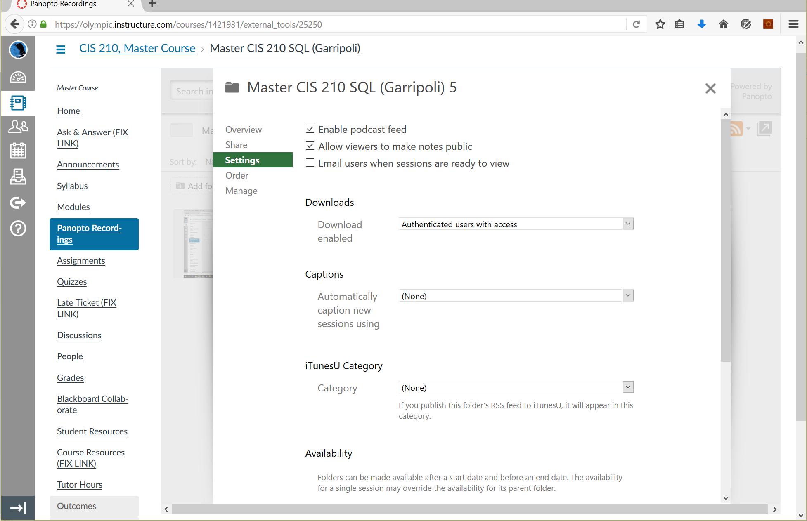
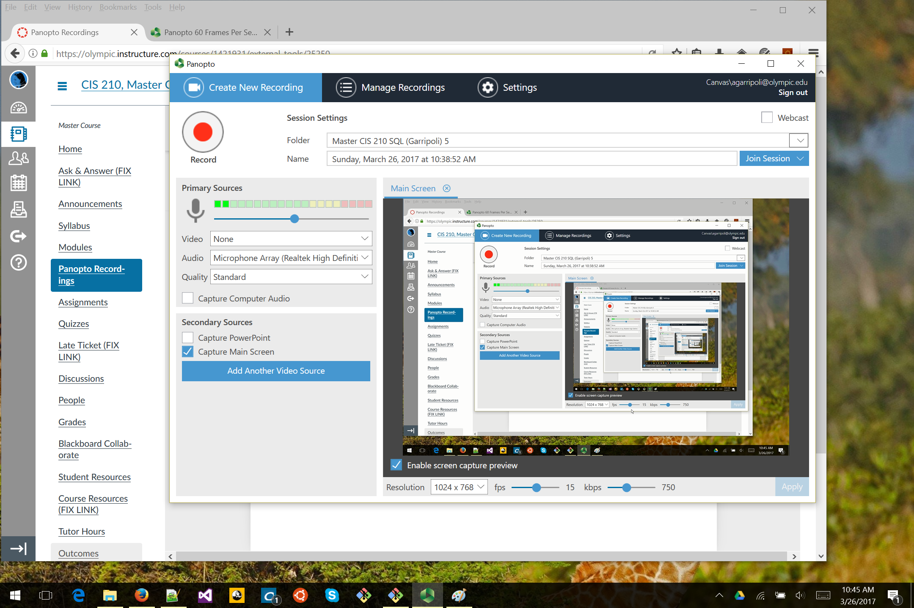
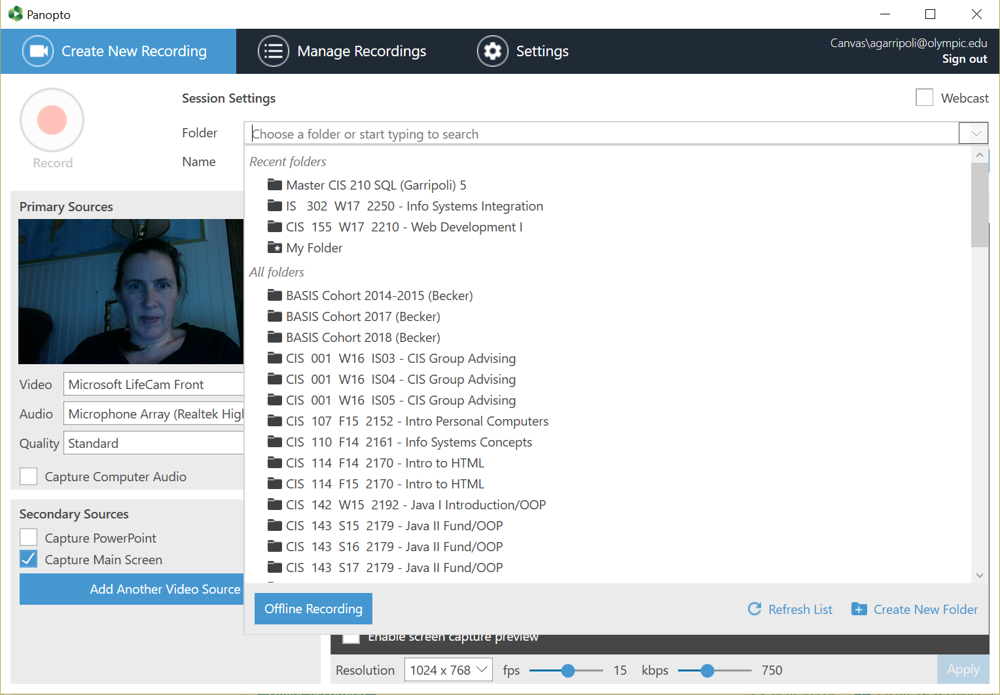
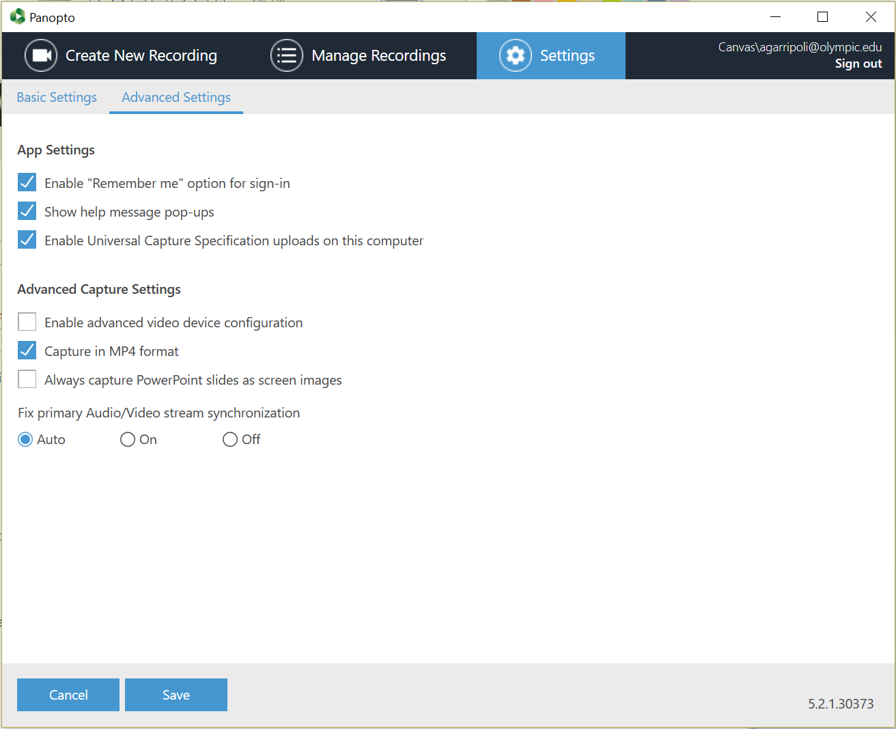
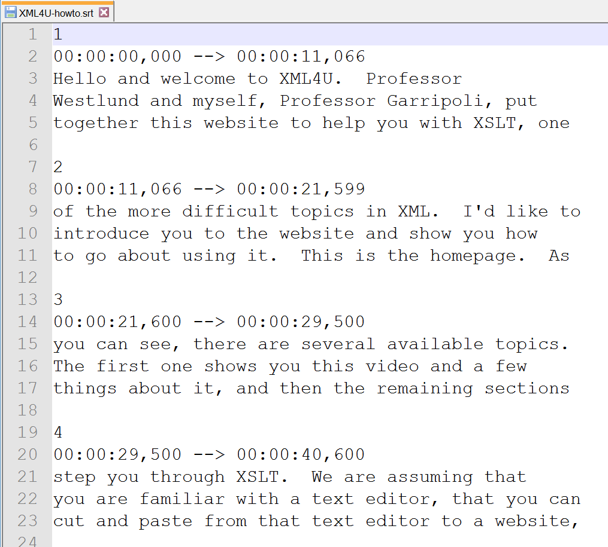

= Using Panopto in Canvas
<agarripoli@olympic.edu>
v30 March 2017 CC-BY-SA-4.0

WACC 2017, Tacoma

This talk is available at http://tinyurl.com/wa-ccpanopto[tinyurl.com/wa-ccpanopto]

Amelia Garripoli, CIS Faculty, Olympic College

:doctype: book
:source-highlighter: coderay
:listing-caption: Listing
:encoding: utf-8
:lang: en
:toc: left
:toclevels: 2
:numbered:
:sectlinks:
:sectanchors:
:copyright: CC-BY-SA-4.0
:backend: revealjs 

////
generate slides with:
asciidoctor -T asciidoctor-reveal.js/templates/slim discuss.adoc
prepare to be amazed 

follow instructions at https://github.com/frederickf/presentable to add a TOC...
////

////
:numbered!:
////

////
== Table of Contents

**** <<_panopto_use,Panopto Use>>
**** <<_panopto_records_your_class,Panopto Records Your Class>>
**** <<_panopto,Panopto>>
**** <<_panopto_setup,Panopto Setup>>
**** <<_Classrooms_with_Webcams,Classrooms with Webcams>>
**** <<_Put_Panopto_in_Course_Shell,Put Panopto in Course Shell>>
**** <<_Panopto_Folder_Settings,Panopto Folder Settings>>
**** <<_check_panopto,Check Panopto >>
**** <<_Whats_Recorded,What's Recorded>>
**** <<_Whats_Recorded_Settings,What's Recorded Settings>>
**** <<_Quality_of_Webcam,Quality of Webcam>>
**** <<_Sound_quality_depends_on_...,Sound quality depends on ...>>
**** <<_Quality_Settings,Quality Settings>>
**** <<_Quality_of_Main_Screen_1,Quality of Main Screen (1)>>
**** <<_Quality_of_Main_Screen_2,Quality of Main Screen (2)>>
**** <<_Check_settings,Check settings>>
**** <<_Settings_(New_Recording),Settings (New Recording)>>
**** <<_Settings_(Basic),Settings (Basic)>>
**** <<_Settings_(Advanced),Settings (Advanced)>>
**** <<_Panopto_Use,Panopto Use>>
**** <<_Record,Record>>
**** <<_Upload,Upload>>
**** <<_Upload,Upload>>
**** <<_Failed_Upload,Failed Upload? >>
**** <<_Panopto_Recording_Files,Panopto Recording Files>>
**** <<_Sound_quality_bad,Sound quality bad?>>
**** <<_What_the_students_see,What the students see>>
**** <<_Adjusting_the_podcast,Adjusting the "podcast">>
**** <<_Podcast_Settings,Podcast Settings>>
**** <<_Reminding_students,Reminding students>>
**** <<_Embed_the_Video_part_1,Embed the Video in a page, part 1>>
**** <<_Get_Embed_HTML_code,Get Embed HTML code>>
**** <<_Embed_the_Video_part_2,Embed the Video in a page, part 2>>
**** <<_Pasted_Result_HTML,Pasted Result (HTML)>>
**** <<_Pasted_Result_Page,Pasted Result (Page)>>
**** <<_The_RSS_shortcut_for_students,The RSS shortcut for students>>
**** <<_RSS_Link_on_Panopto_Recordings_page,RSS Link on Panopto Recordings page>>
**** <<_RSS_Feed_for_Course_Recordings,RSS Feed for Course Recordings>>
**** <<_Subtitles_1,Subtitles? (1)>>
**** <<_SRT_file_example,SRT file example>>
**** <<_Subtitles_2,Subtitles? (2)>>
**** <<_Subtitles_in_Panopto,Subtitles in Panopto>>
**** <<_Subtitles_in_Panopto,Subtitles in Panopto>>
**** <<_other_panopto_tips,Other Panopto Tips>>
**** <<_questions,Questions?>>
**** <<_resources,Resources>>
////

== Panopto Records Your Class

* You control content/view/quality
* Students can:
** navigate video without streaming
** bookmark/annotate
** use RSS feed
** download (MP4)

////
* Blackboard Collaborate
** In Canvas
** Student Interaction
* Third Party
** Completely Control Rendering
** Richer Editing
////

== Panopto

* <<_panopto_setup,Panopto Setup>>
* <<_panopto_use,Panopto Use>>

== Panopto Setup

* Include in course shell
* Check machine setup
* Choose what's in the recording
* Recording quality
* Other settings

////
== Classrooms with Webcams

* A106A-TW-08811
* B206-TW-08781
* CSC102-TW-09371
* HL014-TW-08700
* HL015-TW-10837
* HOC139-TW-08457
* HOC142-TW-08784
* HS110-TW-07910
* HS111-TW-07911
* HS124-TW-07918
* HS129-TW-07920
* HS202-TW-07902
* HS306-TW-07933
* HS347-TW-07904
* **MOBILE-TW-08772**
* **MOBILE-TW-10257**
* OCP105-TW-08785
* OCP108-TW-09980
* OCP220-TW-10009
* OCS-WFTW-07903
* RBS122-TW-20161
* ST136-TW-08427
* T100-TW-10680
* T111-TW-10654
* T201-TW-11109
* T212-TW-09065
* TJL116-TW-08455
* TJL120-TW-07039
////

== Put Panopto in Course Shell

* Course Settings
** Navigation
*** Slide Panopto up to the visible list
** SAVE to keep the navigation change
* Set videos downloadable in folder (check security)
* Put reminders in each module ... more on this later

== Panopto Folder Settings

== Check Panopto 

* Click
** Panopto Recordings
** Create
** Record a New Session
** Launch Panopto
+
If nothing happens, Panopto is not installed on the machine (needs admin to install)
+
Panopto may require a login (use your Canvas credentials)

== What's Recorded

** Primary Screen
** You (it's a good thing, really): audio and/or video
** Secondary Screen (not such a good thing... replay hard)
** PowerPoint (optional, adds text search)

== What's Recorded Settings

== Quality of Webcam

* Primary input is webcam (audio/visual)
* video yes/no -- check lighting
* audio yes/no -- check sound strength (turn it UP)
* quality: affects head size and sound

== Sound quality depends on ...

* The HVAC
* What noise-generators are near your microphone (SURFACE PRO 3)
* Quality of your microphone (LG750 over LG760 and LG730)
* How far away you are from the microphone
** If you wander, get a bluetooth setup in the room -- but test sound again!
* Repeat the question! (students voices dim at best, off-mike)

== Quality Settings

== Quality of Main Screen (1)

* fps = frames per second kbps - kb per second, impacts frame size
* screen resolution, fps, kbps interact to determine recording size; lower is smaller
* 15fps works for most screen use and ok corner webcam
* 30fps gives good webcam recording if full head-shot and screen activity

== Quality of Main Screen (2)

* 1280x720 resolution captures 12-point fonts on full-size viewing; 16-point fonts viewable on phablets
(640x480 very small; 1920x1080 very large)
* kbps, bit rate control -- higher settings will give bigger files with more quality (it's always a trade-off); 750kbps or min permitted for resolution.

== Check settings

* choose folder (set to current class)
* recording name -- consider using date, class, module
* under Basic Settings
** check the recording location -- somewhere persistent, but not a thumb or network drive
** if no second monitor, click "Minimize when recording"
* under Advanced Settings, click "Capture in MP4 format"

== Settings (New Recording)

== Settings (Basic)

image::images/pan-basicsettings.png[]

== Settings (Advanced)

== Panopto Use

* How to Record
* The Upload
* Fixing problems
* Student view
* Download recordings
* Embed recordings
* Adding subtitles
* And more...

== Record

* put Panopto controls on secondary screen or use minimize when recording setting
* the Round Red RECORD button
* Pause may not be your friend (check the recording if you use it; lost in re-rendering)
* You're on!
* When done, click the Square Red STOP button

== Upload

* Uploading doesn't start until recording is done.
* Coordinate with the next instructor in the room 
** if they don't need Panopto, leave it running (lock your login but leave it up) so the upload continues
** if they use Panopto, exit Panopto; otherwise they have to reboot to kill your Panopto to get theirs to start. Your upload continues when they start Panopto 
* If you have to cancel or leave your upload, copy the MP4's for the screen and video/audio (MP3 if just audio) to upload them from another machine (use course's Files area if you don't have a thumb drive)

== Upload

image::images/pan-upload.png[]

== Problems

* Upload fails
* Sound quality bad

== Failed Upload? 

* Use Panopto Recordings-> Create -> Upload Media to create a video from saved MP4's.
* Video/Audio (####.DV.localview.mp4) is primary (upload it)
* Screen (####.SCREEN.localview.mp4) is secondary (edit it in)
* .panrv format if MP4 not selected
* Only need to save these two if you have to walk away from the PC (direct upload to course shell in a pinch for later)

== Panopto Recording Files

image::images/pan-files.png[]

== Sound quality bad?

* Re-record
* or Fix (https://olympic.instructure.com/courses/1421931/external_tools/25250[.] http://olympic.hosted.panopto.com/Panopto/Podcast/Podcast.ashx?courseid=8e9aff7e-370d-48ee-bb23-ca2b75d517a1&type=mp4[samples]): 
** make recording as MP4's, use the one with .DV
** http://www.audacityteam.org/[Audacity+LAME+FFMPEG] to edit (makes an MP3).
** Normalize to make it louder
** Noise Reduction to remove static ( https://diyvideoeditor.com/cleaning-a-voice-track-with-audacity/[how-to] )
** Replace the video primary feed with the improved audio (Advanced Edit on Safari/IE)

== What the students see

* The Panopto Experience
** streaming
** bookmarks/notes
** speed up/slow down/pause

* The RSS feed/podcast/downloaded videos

== Adjusting the "podcast"

* Style of layout 
 ** picture-in-picture
 ** just primary
 ** just secondary (includes audio)
 ** tile all (not recommended for reading screens)
* quality of podcast rendering
** 576p (30fps)
** 720p (30fps) <-- best compromise tablet v. PC
** 1080p (30fps) <-- PC, not streaming video
** 1080p (60fps) <-- PC, streaming video

== Podcast Settings

image::images/pan-podcastquality.png[]

== Reminding students

* Panopto in Course Navigation (not enough)
* Panopto reminder in Modules (use Text Header)
* Panopto link in a Page is always `https://olympic.instructure.com/courses/COURSENUMBER/external_tools/25250`
* Embed the video in a Page 
* Show them the RSS shortcut

== Embed the Video in a page, part 1
** Panopto Recordings
** mouseover the ... by the video you want to bring up the admin menu
** select Share
** Select Embed
** Copy the `<iframe...` code in the text area
+
--- continued on next slide

== Get Embed HTML code

image::images/pan-embedcode.png[]
 
== Embed the Video in a page, part 2

** Edit the Page you want to put it on
** Click HTML Editor
** paste this HTML code on the page (put it at the top if you aren't HTML-comfortable, you can move it next)
** Click Rich Text Editor
** If you don't like where the video is, select it and cut-and-paste it where you want it on the page.

== Pasted Result (HTML)

image::images/pan-embedpaste.png[]

== Pasted Result (Page)

image::images/pan-embeddedvideo.png[]

== The RSS shortcut for students
* Do this on FIREFOX
* Go to Panopto Recordings
* Click orange RSS icon
* Click "Subscribe to RSS" in the pop-up menu
* A page comes up listing the videos,  click to view or right-click to download.
* Students can bookmark that link and return to it to see new videos

== RSS Link on Panopto Recordings page

Works without Canvas login (http://olympic.hosted.panopto.com/Panopto/Podcast/Podcast.ashx?courseid=8e9aff7e-370d-48ee-bb23-ca2b75d517a1&type=mp4[example])

image::images/pan-rss-downloads.png[]

== RSS Feed for Course Recordings

image::images/pan-rss-list.png[]

== Subtitles? (1)

* Need a https://matroska.org/technical/specs/subtitles/srt.html[SRT file]
** https://support.google.com/youtube/answer/6373554[YouTube Generated Captions]: upload to YouTube, get the captions, and export them
** https://www.techsmith.com/camtasia.html[Camtasia] generates captions; trainable to recognize _your_ voice 
** Outside service provider (needs MP4, provides SRT)

== SRT file example

== Subtitles? (2)
* Add the captions to your recording _after_ it is uploaded and processed:
** Panopto Recordings
 ** mouseover the ... by the video you want to bring up the admin menu
 ** select Settings
 ** select Captions
 ** Click Browse ... and pick the srt file
 ** Click Upload Captions

== Subtitles in Panopto
* Not included in the Podcast/MP4 download
* Stream on the side as the student views the recording
* https://olympic.hosted.panopto.com/Panopto/Pages/Viewer.aspx?id=e4440663-b19b-4f99-a187-bb7db5658493[Sample Subtitled Video]

== Subtitles in Panopto

click View in Panopto to see captions

++++
<iframe src="https://olympic.hosted.panopto.com/Panopto/Pages/Embed.aspx?id=e4440663-b19b-4f99-a187-bb7db5658493&v=1" width="720" height="405" style="padding: 0px; border: 1px solid #464646;" frameborder="0" allowfullscreen></iframe>
++++

== Other Panopto Tips

* Clean up local videos through the app
* Editing in Panopto - limited, but can cut off a start/end
* Bookmarks/Notes can be published (won't be in the downloaded MP4s)
* Viewing statistics (won't register downloads, just views within the viewer)

== Questions?

Bonus: Video from January 2016 QM FLC on this topic

++++
<video width="600" height="auto" controls="">
<source src="https://olympic.hosted.panopto.com/Panopto/Podcast/Syndication/20f43948-4e94-4bda-ac7b-d706fc232479.mp4" type="video/mp4"/>
Video not supported, Download <a href="https://olympic.hosted.panopto.com/Panopto/Podcast/Syndication/20f43948-4e94-4bda-ac7b-d706fc232479.mp4">QMFLCPanopto.mp4</a> video 
with Right-click / Save As...
</video>
++++

== Resources

- https://support.panopto.com/documentation[Panopto - Documentation]
- http://www.audacityteam.org/[Audacity]
- http://diyvideoeditor.com/cleaning-a-voice-track-with-audacity/[How to clean the audio track]
- https://matroska.org/technical/specs/subtitles/srt.html[SRT  subtitle file format]
- https://support.google.com/youtube/answer/6373554[YouTube Generated Captions]
- https://www.techsmith.com/camtasia.html[Camtasia]
- http://www.etskb-fac.cidde.pitt.edu/panopto/best-practices-for-adding-captions-to-your-panopto-videos/[U. of Pittsburgh Best Practices on Adding Captions]

This talk is available at http://tinyurl.com/wa-ccpanopto[tinyurl.com/wa-ccpanopto]
